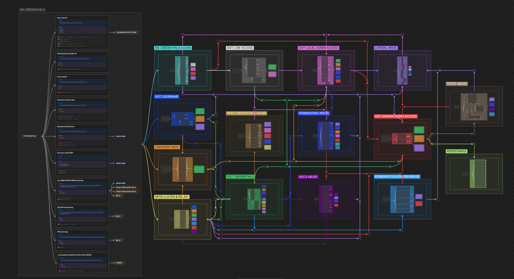

# ADMR — Active Directory Mindmap Recipes  
> *Compromise, à la carte.*

[](https://imp0sters.github.io/ADMR/)  
[](https://imp0sters.github.io/ADMR/)  
[](LICENSE)

---

## 🧾 Overview
**ADMR (Active Directory Mindmap Recipes)** is an **interactive Obsidian-based mindmap** designed for **Active Directory pentesting**.  
It helps red teamers and pentesters quickly navigate **attack paths** and access **theory, tools, and tested commands**.

---

## 🚀 Features
- 🧭 **Organized by context** (no creds → user → local admin → DA → persistence …)  
- 📚 **Theory links** to curated resources  
- 🛠️ **Tools references** (Impacket, NetExec, BloodHound, etc.)  
- 💻 **Ready-to-use commands** tested in real engagements  
- 🔖 **Emoji code system** (priority, risk, type of attack)  
- 🧪 **Offline-ready**: Obsidian vault + MkDocs Material site

---

## 📌 Quick Preview


---

## 💼 How to Use
```bash
git clone https://github.com/Imp0ster/ADMR.git
cd ADMR
# Open in Obsidian OR deploy as MkDocs site
