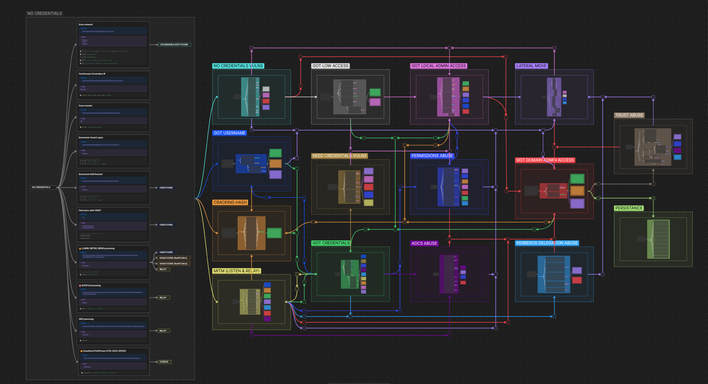

# ADMR — Active Directory Mindmap Recipes  
> *Compromise, à la carte.*

[](https://github.com/Imp0ster/ADMR) [](https://squidfunk.github.io/mkdocs-material/)

---

## 🧭 Overview
**ADMR** is an **interactive, Obsidian‑based mindmap** for **Active Directory pentesting**.  
It organizes actions by **context** and follows a simple pipeline: **input → action → output**.

Built from the field, inspired by the **OCD mindmap** and **Hacker Recipes**, ADMR focuses on **clarity**, **clickability**, and **practical commands** you can run during engagements.

---

## 🚀 Quick Start
```bash
# Clone
git clone https://github.com/Imp0ster/ADMR.git
cd ADMR

# Open as an Obsidian vault
# ...or just browse the mindmap/markdown structure
```

> Need the doc site? This page is the entire documentation (one‑page). Deploy with GitHub Pages.

---

## 🧩 Mindmap Preview


---

## 🧱 Structure & Logic
### Organized by context
- 🔒 **NO CREDENTIALS VULNS**  
- 👤 **GOT USERNAME**  
- 🔑 **GOT CREDENTIALS**  
- 🌀 **GOT LOW ACCESS**  
- 🖥️ **GOT LOCAL ADMIN**  
- 🏰 **GOT DOMAIN ADMIN**  
- 📜 **ADCS ABUSE**  
- 🔓 **CRACKING HASH**  
- 🎫 **KERBEROS DELEGATION ABUSE**  
- ↔️ **LATERAL MOVE**  
- 📡 **MITM (LISTEN & RELAY)**  
- ❓ **NEED CREDENTIALS VULNS**  
- 🛡️ **PERMISSIONS ABUSE**  
- 📌 **PERSISTENCE**  
- 🤝 **TRUST ABUSE**

Each node contains:
- 📚 **Theory** — links to curated resources  
- 🛠 **Tools** — tooling used in practice  
- 💻 **Command list** — tested commands ready to paste  
- 🔖 **Emoji tags** — priority & risk at a glance

---

## 🏷️ Emoji Code System
### Attack Types
- 🔥 Quick wins — easy, fast, low‑noise  
- 💥 CVE — public vulnerabilities  
- 🚨 Can break things — risky/noisy  
- 🛠️ Work‑in‑progress — still maturing

### Tool Tags
- ⚪ Linux commands · ⚫ CMD (Windows) · 🔵 PowerShell · 🟣 Impacket · 🔴 BloodHound · 🕷️ NetExec · Ⓜ️ Metasploit

---

## 💼 How to Use
1. Clone the repo and **open it as an Obsidian vault**.  
2. Navigate by **context** depending on your current foothold.  
3. Use **theory**, **commands**, and **tools** sections to act quickly.  
4. Extend with your **own recipes** as you learn.

---

## 🤝 Contributing
We welcome PRs and issues:
- Add techniques, fix typos, improve structure, or add links
- Propose refactors to keep the mindmap practical
- Use feature branches (`feat/...`) and write clear commit messages

**Open a PR:** https://github.com/Imp0ster/ADMR/pulls  
**Open an issue:** https://github.com/Imp0ster/ADMR/issues

---

## 👥 Authors
- **Amine B.** ([@gr0bot](https://github.com/gr0bot))  
- **Evariste Gwanulaga** ([@bl4ckarch](https://github.com/bl4ckarch))

---

## 📄 License
Licensed under **GNU GPLv3**.  
Use, modify, and share — please credit the authors.

---

## 🙏 Acknowledgments
- **[Orange Cyberdefense — OCD Mindmaps](https://github.com/Orange-Cyberdefense/ocd-mindmaps)**
- **[Hacker Recipes](https://www.thehacker.recipes/)**
- **[Ecole 2600](https://www.2600.eu/)**

---
